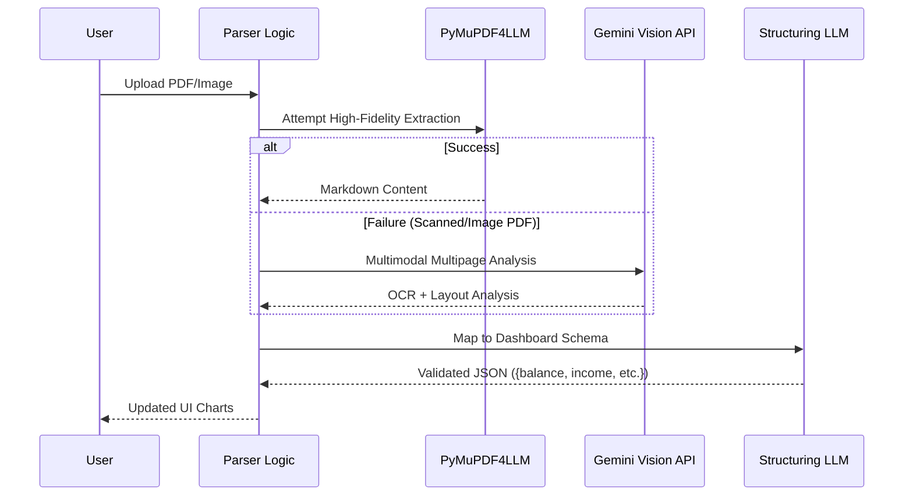

# 🏛️ ArthSaathi Technical Architecture Registry

This document provides an exhaustive technical deep-dive into the architectural decisions, data flows, and intelligence pipelines powering the ArthSaathi Financial Ecosystem.

---

## 🧭 Design Philosophy
ArthSaathi is built on the principle of **"Agentic Autonomy with Deterministic Guardrails."** The system balances the creativity of LLMs with the reliability of structured data parsers and localized compliance knowledge bases.

---

## 🏗️ 1. Infrastructure Overview

The system is deployed as a decoupled micro-service-ready architecture within a FastAPI container.

### 🌐 High-Level Stack
- **API Runtime**: FastAPI (Python 3.10+) utilizing `lifespan` handlers for pre-indexing.
- **Orchestrator**: Agno (Multi-Agent framework with coordinated reasoning).
- **Primary LLM**: Gemini 1.5/2.0 Flash (Low latency, high context window).
- **Secondary LLM (GST Report)**: Groq (Mixral-8x7b / LLama 3) for deterministic, high-speed structured generation.
- **Vector Engine**: FAISS (IndexFlatIP) for lightning-fast inner-product semantic search.
- **Embeddings**: Google `text-embedding-004` (768-dim specialized for retrieval).

---

## 🧬 2. Intelligence Layer: The Multi-Agent Team

ArthSaathi utilizes a **Coordinator Pattern** where a Lead Analyst routes specialized tasks to sub-agents.

### 👥 Agent Registry
| Agent Name | Role | Primary Goal | Guardrails |
| :--- | :--- | :--- | :--- |
| **Budgeting Analyst** | Cash Flow Expert | Identify spending leaks & optimize 50-30-20 splits. | Cannot allocate investments. |
| **Savings Strategist** | Habit Architect | Build emergency fund resilience markers. | Strictly limited to liquidity planning. |
| **Investment Educator**| Market Scholar | Explain ETFs, MF, and Equity concepts. | **Strictly NO stock tips/calls.** |
| **Coordinator Team** | Lead Advisor | Synthesize all inputs into a single UI JSON. | Ensures consistent tone and scoring. |

---

## 📄 3. Multimodal Data Ingestion Pipeline

The ingestion pipeline is designed to be "zero-failure." It uses a polymorphic approach to process bank statements and financial documents.

---

## 📜 4. GST RAG Strategy (Deep Dive)

The GST Advisor uses a **Parent-Child Chunking Strategy** to solve the "Context vs. Precision" trade-off.

### 🔍 Search Workflow
1. **Parent-Child Logic**: The PDF is split into large contexts (**Parents - 1800 chars**) and overlapping small snippets (**Children - 400 chars**).
2. **Indexing**: Only Children are indexed in FAISS for high-recall semantic matching.
3. **Retrieval**: When a Child matches, the system retrieves its corresponding **Parent** to provide the LLM with sufficient legal context.
4. **Validation**: The retrieved KB (Knowledge Base) content is cross-referenced with **Tavily Web Search** to ensure recent amendments (e.g., GST Council updates in 2025) are included.

---

## 🔊 5. Conversational UI & Voice Pipeline

ArthSaathi implements a "Conversational Funnel" to gather high-quality financial profiles.

### 🎙️ The Voice-First Loop
1. **STT (Sarvam AI)**: Captures user intent in English/Indian-context.
2. **Analysis**: AI identifies the intent (e.g., "Retirement Planning").
3. **Follow-up Generation**: Instead of a static form, the LLM generates 3 dynamic questions based on missing profile data.
4. **TTS (Sarvam Bulbul v3)**: The questions are spoken back in a natural Indian accent.
5. **Final Synthesis**: All answers + Real-time Market Data + User Financial History are merged into a final PDF/Report.

---

## 📊 6. Database Schema & Persistence

### 💾 MongoDB Strategy
- **Users Collection**: Profile details, encrypted auth tags, and rank progression.
- **Financial Snapshots**: Historical time-series data of parsed statements (allows for "Net Worth trend" tracking).
- **Goals Table**: Target amounts vs. current AI-projected savings.

### 🏛️ Ranking & Gamification
- **Level 1-5 Logic**: Based on "Financial Health Score" and "Goal Consistency."
- **Assets**: Lottie animations mapped via `rank_logic.js`.

---

## 🛡️ 7. Security & Privacy

1. **Context Isolation**: No PII (Personally Identifiable Information) is sent to external APIs except in anonymous financial context.
2. **Deterministic Output**: All internal scoring (0-100) follows a logic-check before rendering to prevent "AI Hallucinations" on balance sheets.
3. **API Key Management**: Global rotation and per-session limit monitoring.

---

## 🛠️ 8. Integration Map

- **Alpha Vantage**: Global Market Quotes & News Sentiment.
- **Sarvam AI**: Speech-to-Text (`saaras:v3`) & Text-to-Speech (`bulbul:v3`).
- **Tavily**: Financial Search & Regulatory Fact-checking.
- **Groq**: Specialized RAG inference for low-latency reporting.

---
*Created and maintained by the ArthSaathi Engineering Team (Karansankhe/ArthSaathi)*
