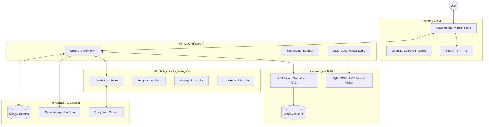

# 🪙 ArthSaathi: Autonomous AI Financial Advisor

ArthSaathi is a sophisticated, multi-agent financial platform designed to provide personalized financial guidance, automated expense tracking, and expert GST advice. It leverages state-of-the-art AI models and a robust RAG (Retrieval-Augmented Generation) pipeline to transform raw financial data into actionable insights.

---

## 🏗️ Technical Architecture

ArthSaathi follows a modern, distributed architecture combining asynchronous backend processing with a multi-agent AI framework.

### 🏛️ System Overview (Mermaid)



---

## 🚀 Key Features & Capabilities

### 1. 🤖 Multi-Agent Financial Team
Powered by **Agno (formerly Phidata)**, ArthSaathi deploys a team of specialized agents:
- **Budgeting Analyst**: Identifies spending leaks and optimizes cash flow.
- **Savings Strategist**: Recommends emergency fund goals and habit changes.
- **Investment Educator**: Explains market concepts without providing direct financial advice (Safety First).
- **Coordinator**: Synthesizes inputs into a "Comprehensive Financial Health Score."

### 2. 📄 Multi-Modal Data Ingestion
A robust parser that handles financial statements (PDFs, Images, CSVs):
- **Primary**: `pymupdf4llm` for high-fidelity markdown extraction.
- **Fallback**: **Gemini 1.5/2.0 Pro/Flash Vision** for scanned or complex OCR tasks via multimodal analysis.
- **Structured Output**: Automatically maps raw text to a dashboard-ready JSON schema for real-time visualization.

### 3. 📜 GST Advisor (Advanced RAG)
A dedicated compliance engine for Indian taxation:
- **Vector Search**: FAISS index containing the latest GST legal frameworks.
- **Semantic Retrieval**: USes `text-embedding-004` (Gemini) for highly accurate context retrieval.
- **Inference**: **Groq (LLama-3/Mixtral)** for lightning-fast structured report generation.
- **Web-Augmented**: Validates law against live news via Tavily Integration.

### 4. 📈 Real-Time Market Integration
- **Alpha Vantage**: Fetches live quotes for Stocks, Commodities (Gold/Oil), and Forex.
- **Smart Fallback**: Implements a simulated market engine if API limits are reached, ensuring zero UI downtime.

### 5. 🎤 Hyper-Localized Voice AI
Integrated with **Sarvam API**, providing high-quality support for Indian context:
- **Speech-to-Text (STT)**: Allows users to query their finances verbally.
- **Text-to-Speech (TTS)**: Personalized voice responses for a "Financial Concierge" experience.

---

## 🛠️ Technology Stack

| Layer | Technology |
| :--- | :--- |
| **Backend** | Python 3.10+, FastAPI, Uvicorn/Gunicorn |
| **AI Framework** | Agno (Multi-Agent), Groq (Fast Inference) |
| **LLM Models** | Gemini 2.5 Flash, Gemini 1.5 Flash (Vision) |
| **Database** | MongoDB Atlas (NoSQL), FAISS (Vector Store) |
| **Parsing** | PyMuPDF4LLM, Gemini Multimodal File API |
| **Frontend** | Jinja2 Templates, Vanilla JS, CSS Glassmorphism |
| **Integrations** | Alpha Vantage, Tavily Search, Sarvam AI |

---

## 📂 Project Structure

```bash
📦 ITM_HACKS
 ┣ 📂 templates        # Jinja2 HTML Templates (Dashboards, Auth)
 ┣ 📂 static           # UI Assets (CSS, JS, Lottie JSON, Favicons)
 ┣ 📜 main.py          # Unified FastAPI Application Entry Point
 ┣ 📜 parser_logic.py  # PDF & Multimodal Data Extraction Logic
 ┣ 📜 gst_advisor.py   # RAG Pipeline for GST Analysis
 ┣ 📜 chatbot_logic.py # Core LLM Orchestration & Voice Processing
 ┣ 📜 shopping_logic.py# Specialized retail financial analysis
 ┣ 📜 requirements.txt # Dependency Manifest
 ┗ 📜 .env             # Global Secret Management (API Keys)
```

---

## 🛠️ Setup & Installation

1. **Clone the repository**:
   ```bash
   git clone <repository-url>
   cd ITM_HACKS
   ```

2. **Configure Environment Variables**:
   Create a `.env` file with the following keys:
   ```env
   GEMINI_API_KEY=your_key
   GROQ_API_KEY=your_key
   TAVILY_API_KEY=your_key
   AV_API_KEY=your_key
   MONGODB_URI=your_atlas_uri
   SARVAM_API_KEY=your_key
   ```

3. **Install Dependencies**:
   ```bash
   pip install -r requirements.txt
   ```

4. **Run Application**:
   ```bash
   uvicorn main:app --host 0.0.0.0 --port 8000 --reload
   ```

---

## 🛡️ Security & Privacy
- **Stateless AI**: Financial data is processed and stored securely in MongoDB Atlas.
- **API Safety**: All LLM calls are structured via Pydantic to prevent prompt injection and ensure data consistency.
- **No-Financial-Advice Guardrails**: Agents are strictly programmed to educate and analyze, never to provide regulated financial advice.

---
**ArthSaathi** — *Empowering your financial journey with Intelligent Autonomy.*
